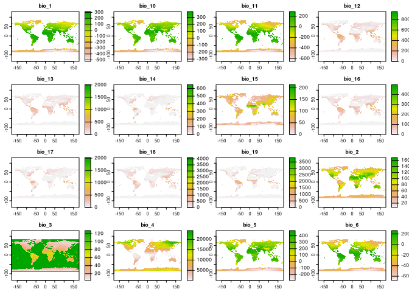

<!-- README.md is generated from README.Rmd. Please edit that file -->

# rpaleoclim: download paleoclimate data from PaleoClim in R

<!-- badges: start -->

[](https://www.repostatus.org/#active)
[](https://CRAN.R-project.org/package=rpaleoclim)
[](https://github.com/joeroe/rpaleoclim/actions)
[](https://app.codecov.io/gh/joeroe/rpaleoclim?branch=master)
[](https://zenodo.org/badge/latestdoi/199434717)
<!-- badges: end -->

[PaleoClim](http://www.paleoclim.org) is a set of free, high resolution
paleoclimate surfaces covering the whole globe. It includes data on
surface temperature, precipitation and the standard bioclimatic
variables commonly used in ecological modelling, derived from the HadCM3
general circulation model and downscaled to a spatial resolution of up
to 2.5 minutes.

This package provides a simple interface for downloading PaleoClim data
in R, with support for caching and filtering retrieved data by period,
resolution, and geographic extent.

## Installation

You can install the latest release of rpaleoclim from
[CRAN](https://cran.r-project.org/) with:

``` r
install.packages("rpaleoclim")
```

Or the development version from
[GitHub](https://github.com/joeroe/rpaleoclim) using the
[`remotes`](https://github.com/r-lib/remotes) package:

``` r
remotes::install_github("joeroe/rpaleoclim")
```

## Usage

The package includes two functions, `paleoclim()` and
`load_paleoclim()`. `paleoclim()` downloads data from PaleoClim with the
desired period and resolution and reads it into R as a
[SpatRaster](https://rspatial.org/spatial/4-rasterdata.html) object.

``` r
library("rpaleoclim")
library("terra") # For plotting

paleoclim("lh", "10m") |>
  plot()
```



By default, files from PaleoClim are cached in a local temporary
directory to avoid repeated download of the same data.
`load_paleoclim()` reads local PaleoClim files (in `.zip` format) in the
same way.

For further details see the [introduction to
rpaleoclim](https://rpaleoclim.joeroe.io/articles/rpaleoclim.html)
vignette (`vignette("rpaleoclim")`).

## Citation

Please follow the [instructions from the
authors](http://www.paleoclim.org/how-to-cite/) when citing PaleoClim
data. At time of writing, this includes a citation to the paper the
describing the PaleoClim database:

- Brown, J.L., Hill, D.J., Dolan, A.M., Carnaval, A.C., Haywood,
  A.M., 2018. [PaleoClim, high spatial resolution paleoclimate surfaces
  for global land areas](https://www.nature.com/articles/sdata2018254).
  *Scientific Data* 5, 180254. <doi:10.1038/sdata.2018.254>

As well as the original papers for the individual original datasets
used.

Use `citation("paleoclim")` for more details and the references in
BibTeX format.
