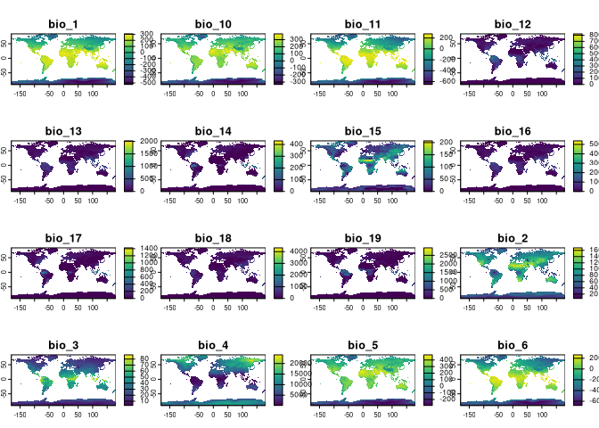

<!-- README.md is generated from README.Rmd. Please edit that file -->

# rpaleoclim: an R interface for *PaleoClim* paleoclimate data

<!-- badges: start -->

[](https://www.repostatus.org/#wip)
[](https://CRAN.R-project.org/package=rpaleoclim)
[](https://github.com/joeroe/rpaleoclim/actions)
[](https://app.codecov.io/gh/joeroe/rpaleoclim?branch=master)
<!-- badges: end -->

[PaleoClim](http://paleoclim.org) is a set of free, high resolution
paleoclimate surfaces covering the whole globe. It includes the standard
bioclimatic variables commonly used in ecological modelling, downscaled
from the HadCM3 general circulation model for key time periods, at up to
2.5 minute spatial resolution.

This package provides a simple interface for downloading PaleoClim data
in R, with support for spatial queries and caching.

## Installation

You can install the development version of rpaleoclim from GitHub using
the [`remotes`](https://github.com/r-lib/remotes) or
[`devtools`](https://github.com/r-lib/devtools) packages:

``` r
remotes::install_github("joeroe/rpaleoclim")
```

## Usage

The package includes two functions, `paleoclim()` and
`load_paleoclim()`. `paleoclim()` downloads data from PaleoClim with the
desired period and resolution and reads it into R as a
[raster](https://rspatial.org/raster/) object.

``` r
library("rpaleoclim")
library("raster")

paleoclim("lh", "10m") |>
  plot()
```



`paleoclim()` can also crop the output raster to a desired region:

``` r
europe <- c(-15, 45, 30, 90)

paleoclim("lh", "10m", region = europe) |>
  plot()
```


By default, files from PaleoClim are cached in a local temporary
directory to avoid repeated download of the same data.

`load_paleoclim()` reads local PaleoClim files (in `.zip` format) in the
same way.

## Citation

Please follow the [instructions from the
authors](http://paleoclim.org/how-to-cite/) when citing PaleoClim data.
At time of writing, this includes a citation to the paper the describing
the PaleoClim database:

-   Brown, J.L., Hill, D.J., Dolan, A.M., Carnaval, A.C., Haywood,
    A.M., 2018. [PaleoClim, high spatial resolution paleoclimate
    surfaces for global land
    areas](https://www.nature.com/articles/sdata2018254). *Scientific
    Data* 5, 180254. <doi:10.1038/sdata.2018.254>

As well as the original papers for the individual original datasets
used.

Use `citation("paleoclim")` for more details and the references in
BibTeX format.
