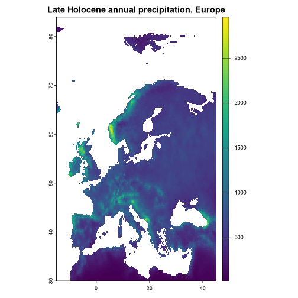

# Introduction to rpaleoclim

[PaleoClim](http://www.paleoclim.org)[¹](#fn1) is a set of free, high
resolution paleoclimate surfaces covering the whole globe. It includes
data on surface temperature, precipitation and the standard bioclimatic
variables commonly used in ecological modelling, derived from the HadCM3
general circulation model and downscaled to a spatial resolution of up
to 2.5 minutes. Simulations are available for key time periods from the
Late Holocene to mid-Pliocene. Data on current and Last Glacial Maximum
climate is derived from [CHELSA](https://chelsa-climate.org/)[²](#fn2)
and reprocessed by PaleoClim to match their format; it is available at
up to 30 seconds resolution.

This package provides a simple interface for downloading PaleoClim data
in R, with support for caching and filtering retrieved data by period,
resolution, and geographic extent.

## Installation

You can install the development version of rpaleoclim from GitHub using
the [`remotes`](https://github.com/r-lib/remotes) package:

``` r
remotes::install_github("joeroe/rpaleoclim")
```

It depends on `terra`, which in turn requires a recent version of the
the system libraries [GDAL](https://gdal.org/) and
[PROJ](https://proj.org/). These are included in the binary releases of
`terra` for Windows and MacOS, but if you build from source (e.g. on
Linux) you might need to install them first; see the [terra
README](https://github.com/rspatial/terra#from-source-code) for
instructions for different systems.

## Data available

rpaleoclim provides an R interface to download all the data listed at
<http://www.paleoclim.org/> and currently mirrored at
<http://www.sdmtoolbox.org>. The tables below were last updated
2022-02-16; please refer to the PaleoClim website for the authoritative
version.

If you notice a change or update to the PaleoClim data structure that
isn’t supported by the current version of the package, please report it
at: <https://github.com/joeroe/rpaleoclim/issues>.

### Periods

PaleoClim includes climate reconstructions from simulations of the
following time intervals, supplemented with two additional datasets from
CHELSA:

| code  | period                             | bp            | source                    |
|:------|:-----------------------------------|:--------------|:--------------------------|
| cur   | Current (1979 – 2013)              |               | CHELSA                    |
| lh    | Late Holocene: Meghalayan          | 4.2-0.3 ka    | Fordham  et al. 2017      |
| mh    | Mid Holocene: Northgrippian        | 8.326-4.2 ka  | Fordham  et al. 2017      |
| eh    | Early Holocene: Greenlandian       | 11.7-8.326 ka | Fordham  et al. 2017      |
| yds   | Pleistocene: Younger Dryas Stadial | 12.9-11.7 ka  | Fordham  et al. 2017      |
| ba    | Pleistocene: Bølling-Allerød       | 14.7-12.9 ka  | Fordham  et al. 2017      |
| hs1   | Pleistocene: Heinrich Stadial 1    | 17.0-14.7 ka  | Fordham  et al. 2017      |
| lgm   | Pleistocene: Last Glacial Maximum  | ca. 21 ka     | CHELSA                    |
| lig   | Pleistocene: Last Interglacial     | ca. 130 ka    | Otto-Bliesner et al. 2006 |
| mis19 | Pleistocene: MIS19                 | ca. 787 ka    | Brown et al. 2018         |
| mpwp  | Pliocene: Mid-Pliocene warm period | 3.205 Ma      | Hill 2015                 |
| m2    | Pliocene: M2                       | ca. 3.3 Ma    | Dolan et al. 2015         |

### Bioclimatic variables

PaleoClim uses the 16 standard “bioclimatic variables” with their
conventional coding:

| biovar | definition                           | formula              |
|:-------|:-------------------------------------|:---------------------|
| bio_1  | Mean annual temperature              |                      |
| bio_2  | Mean diurnal range                   |                      |
| bio_3  | Isothermality                        | (bio2 / bio7) \* 100 |
| bio_4  | Temperature seasonality              | sd(temp) \* 100      |
| bio_5  | Maximum temperature of warmest month |                      |
| bio_6  | Minimum temperature of coldest month |                      |
| bio_7  | Annual temperature range             | bio5 - bio6          |
| bio_8  | Mean temperature of wettest quarter  |                      |
| bio_9  | Mean temperature of driest quarter   |                      |
| bio_10 | Mean temperature of warmest quarter  |                      |
| bio_11 | Mean temperature of coldest quarter  |                      |
| bio_12 | Total annual precipitation           |                      |
| bio_13 | Precipitation of wettest month       |                      |
| bio_14 | Precipitation of driest month        |                      |
| bio_15 | Precipitation seasonality            |                      |
| bio_16 | Precipitation of wettest quarter     |                      |
| bio_17 | Precipitation of driest quarter      |                      |
| bio_18 | Precipitation of warmest quarter     |                      |
| bio_19 | Precipitation of coldest quarter     |                      |

### Other options

The options for `resolution` are:

- `"10m"`: 10 minutes, c. 16 km at 30° N/S
- `"5m"`: 5 minutes, c. 8 km at 30° N/S
- `"2_5m"`: 2.5 minutes, c. 4 km at 30° N/S
- `"30s"`: 30 seconds, c. 1 km at 30° N/S (only available for `"cur"`
  and `"lgm"`)

## Retrieving data

``` r
library(rpaleoclim)
library(terra)
#> terra 1.8.54
```

Use [`paleoclim()`](http://joeroe.io/rpaleoclim/reference/paleoclim.md)
to download paleoclimate data from PaleoClim, specifying the desired
time period (see above) and resolution. For example, to download data
for the Late Holocene (`"lh"`) at 10 min resolution:

``` r
paleoclim("lh", "10m")
#> class       : SpatRaster 
#> size        : 1044, 2160, 19  (nrow, ncol, nlyr)
#> resolution  : 0.1666667, 0.1666667  (x, y)
#> extent      : -180.0001, 179.9999, -90.00014, 83.99986  (xmin, xmax, ymin, ymax)
#> coord. ref. : lon/lat WGS 84 (EPSG:4326) 
#> sources     : bio_1.tif  
#>               bio_10.tif  
#>               bio_11.tif  
#>               ... and 16 more sources
#> names       : bio_1, bio_10, bio_11, bio_12, bio_13, bio_14, ... 
#> min values  :  -526,   -334,   -656,      0,      0,      0, ... 
#> max values  :   314,    385,    288,   9696,   2399,    651, ...
```

The result is a `SpatRaster` object with up to 19 layers containing
reconstructed values of the standard “bioclimatic variables” (see above)
for this period. Consult the `terra` documentation for information on
[working with spatial raster
data](https://rspatial.org/spatial/4-rasterdata.html) in R.

By default,
[`paleoclim()`](http://joeroe.io/rpaleoclim/reference/paleoclim.md)
loads the entire downloaded raster into R, i.e. the whole globe. You can
conveniently crop it to a specific (rectangular) region of interest with
the `region` argument. This can be specified with a `SpatExtent` object
or anything coercible to one (see
[`?terra::ext`](https://rspatial.github.io/terra/reference/ext.html)),
which includes most spatial data types, or simply a vector of
coordinates (xmin, xmax, ymin, ymax):

``` r
europe <- c(-15, 45, 30, 90)
europe_lh <- paleoclim("lh", "10m", region = europe)
#> Reading cached PaleoClim data from /tmp/Rtmppj4CG4/LH_v1_10m.zip
#> ℹ Use `skip_cache = TRUE` to force redownload.

plot(europe_lh[["bio_12"]], main = "Late Holocene annual precipitation, Europe")
```



plot of chunk eg-paleoclim-crop

If you have already downloaded data from PaleoClim and simply want to
read it into R, you can do so with
[`load_paleoclim()`](http://joeroe.io/rpaleoclim/reference/load_paleoclim.md),
passing it the path to the `.zip` archive:

``` r
zipfile <- system.file("testdata", "LH_v1_10m_cropped.zip",
                       package = "rpaleoclim")
load_paleoclim(zipfile)
#> class       : SpatRaster 
#> size        : 6, 6, 19  (nrow, ncol, nlyr)
#> resolution  : 0.1666667, 0.1666667  (x, y)
#> extent      : 0, 1, 0, 1  (xmin, xmax, ymin, ymax)
#> coord. ref. : lon/lat WGS 84 (EPSG:4326) 
#> sources     : bio_1.tif  
#>               bio_10.tif  
#>               bio_11.tif  
#>               ... and 16 more sources
#> names       : bio_1, bio_10, bio_11, bio_12, bio_13, bio_14, ... 
#> min values  :  -526,   -334,   -656,      0,      0,      0, ... 
#> max values  :   314,    385,    288,   9696,   2399,    651, ...
```

### Caching

Note that in the examples above, we only downloaded data from the
PaleoClim servers once. Repeated calls to
[`paleoclim()`](http://joeroe.io/rpaleoclim/reference/paleoclim.md) that
ask for the same time period and resolution reuse cached versions of the
previously downloaded file. By default, these files are stored in R’s
temporary directory, so that you only download the files once per
session. The cached files are never modified; subsequent cropping,
warping, etc. is either done in-memory or creates new temporary files.

The `cache_path` argument controls the directory that
[`paleoclim()`](http://joeroe.io/rpaleoclim/reference/paleoclim.md)
downloads files to and tries to read cached data from. It can be useful
to change this to somewhere within the working directory to reuse the
same files between sessions and ensure your analysis can be reproduced
in the future, even if the remote PaleoClim data changes or disappears.

`skip_cache = TRUE` will force
[`paleoclim()`](http://joeroe.io/rpaleoclim/reference/paleoclim.md) to
download files from PaleoClim even if cached data exists in `cache_path`
(in which case it will overwrite it).

`quiet = TRUE` suppresses messages about whether the data is being
downloaded or read from a cached file.

### Backwards compatibility with `raster`

Since version 0.9.1, rpaleoclim has depended on the
[terra](https://rspatial.org/terra/) package for reading and
manipulating spatial data. Previous versions used
[raster](https://rspatial.org/raster/) and `rgdal`, which [are now
deprecated](https://r-spatial.org/r/2022/04/12/evolution.html). To use
the old `raster` types, you will need to install the optional dependency
`raster`:

``` r
install.packages(c("raster"))
```

Then pass `as = "raster"` to
[`paleoclim()`](http://joeroe.io/rpaleoclim/reference/paleoclim.md) or
[`load_paleoclim()`](http://joeroe.io/rpaleoclim/reference/load_paleoclim.md)
to return the data as a `RasterStack` object instead of a `SpatRaster`.

``` r
paleoclim("lh", "10m", as = "raster")
#> Reading cached PaleoClim data from /tmp/Rtmppj4CG4/LH_v1_10m.zip
#> ℹ Use `skip_cache = TRUE` to force redownload.
#> Warning: `as = "raster"` is deprecated and will be removed in future versions of rpaleoclim
#> This warning is displayed once per session.
#> class      : RasterStack 
#> dimensions : 1044, 2160, 2255040, 19  (nrow, ncol, ncell, nlayers)
#> resolution : 0.1666667, 0.1666667  (x, y)
#> extent     : -180.0001, 179.9999, -90.00014, 83.99986  (xmin, xmax, ymin, ymax)
#> crs        : +proj=longlat +datum=WGS84 +no_defs 
#> names      : bio_1, bio_10, bio_11, bio_12, bio_13, bio_14, bio_15, bio_16, bio_17, bio_18, bio_19, bio_2, bio_3, bio_4, bio_5, ... 
#> min values :  -526,   -334,   -656,      0,      0,      0,      0,      0,      0,      0,      0,     6,     3,   116,  -292, ... 
#> max values :   314,    385,    288,   9696,   2399,    651,    215,   6321,   2025,   5128,   3860,   169,    90, 24243,   481, ...
```

Please note that `raster` support will be removed in a future version of
`rpaleoclim`.

## Citing data

Please follow the [instructions from the
authors](http://www.paleoclim.org/how-to-cite/) when citing PaleoClim
data. At time of writing, this includes a citation to the paper the
describing the PaleoClim database:

- Brown, J.L., Hill, D.J., Dolan, A.M., Carnaval, A.C., Haywood,
  A.M., 2018. [PaleoClim, high spatial resolution paleoclimate surfaces
  for global land areas](https://www.nature.com/articles/sdata2018254).
  *Scientific Data* 5, 180254. <doi:10.1038/sdata.2018.254>

As well as the original papers for the individual original datasets
used.

Use `citation("paleoclim")` for more details and the references in
BibTeX format.

------------------------------------------------------------------------

1.  Brown, J., Hill, D., Dolan, A. et al. PaleoClim, high spatial
    resolution paleoclimate surfaces for global land areas. *Sci Data*
    5, 180254 (2018). <https://doi.org/10.1038/sdata.2018.254>

2.  Karger, D., Conrad, O., Böhner, J. et al. Climatologies at high
    resolution for the earth’s land surface areas. *Sci Data* 4, 170122
    (2017). <https://doi.org/10.1038/sdata.2017.122>
